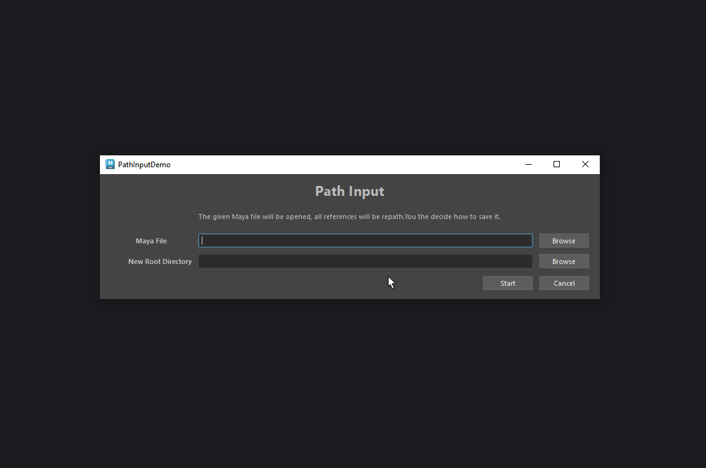

# cmds_interface_demo

Give basic notions to create a simple window in an object-oriented way using
only `maya.cmds` API.

This requires that you have the basics at how a class works.

# pizza_creator

Store data "outside" of the interface and edit it form the interface.

# path_input

Common use case where you have to get input of paths from the user.

