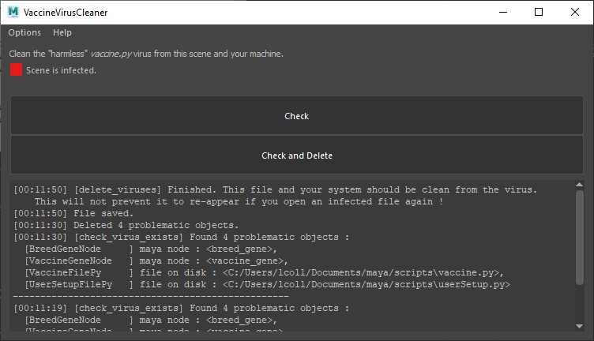

# Virus Cleaner


A utility aimed at removing the `vaccine.py` virus from the currently openened
maya scene and from  your system. This is a "harmless" virus, but you don't
want it to spread.

|Clean Scene                   | Infected scene cleaned    |
|:----------------------------:|:-------------------------:|
| |  |

This doesn't prevent the virus to infects your system/files again. For this 
you can have a look at this thread :

> https://discourse.techart.online/t/another-maya-malware-in-the-wild/12970

# Utilisation

Compatible with Python 2.7 and above.

Copy the [virus_cleaner.py](virus_cleaner.py) file in the Maya Script Editor
and run the script. A window should appear.

You then have the choice to only check if your scene/system is infected or
check and delete the virus.

# API

If you don't want to use the interface you can use it like a module :

```python
import virus_cleaner

viruses = virus_cleaner.check_virus_exists()  # type: List[virus_cleaner.BaseVirusObject]
virus_cleaner.delete_virus()
```

The function has to be executed in a Maya context to work.

Note that `delete_virus` is already calling `check_virus_exists`. They can  
both be called independently.