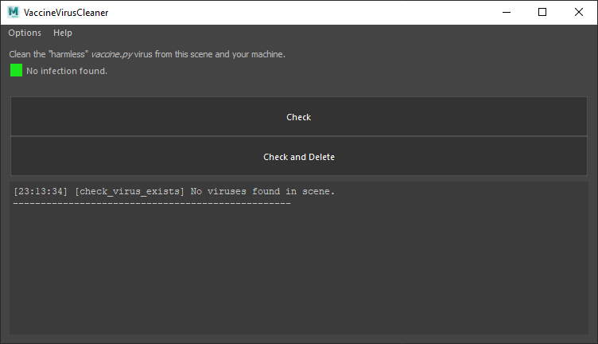

# Virus Cleaner

A utility aimed at removing the `vaccine.py` virus from the currently openened
maya scene and from  your system. This is a "harmless" virus, but you don't
want it to spread.



This doesn't prevent the virus to infects your system/files again. For this 
you can have a look at this thread :

> https://discourse.techart.online/t/another-maya-malware-in-the-wild/12970

# API

If you don't want to use the interface you can use it like a module :

```python
import virus_cleaner

virus_cleaner.check_virus_exists()
virus_cleaner.delete_virus()
```

The function has to be executed in a Maya context to work.